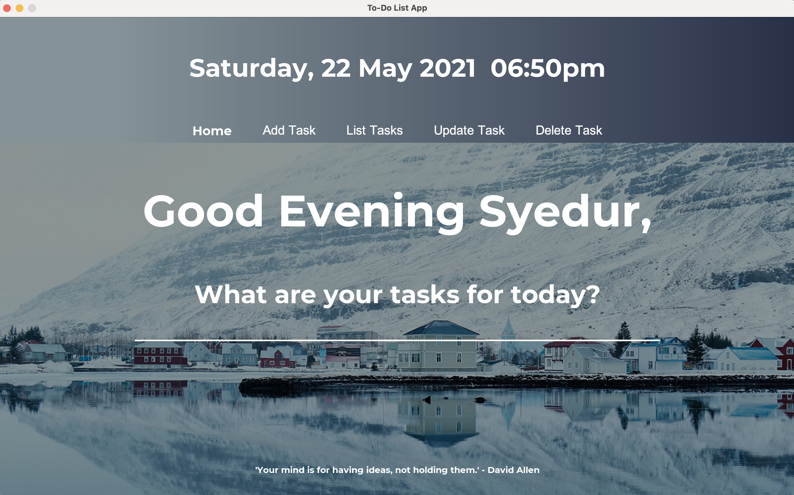
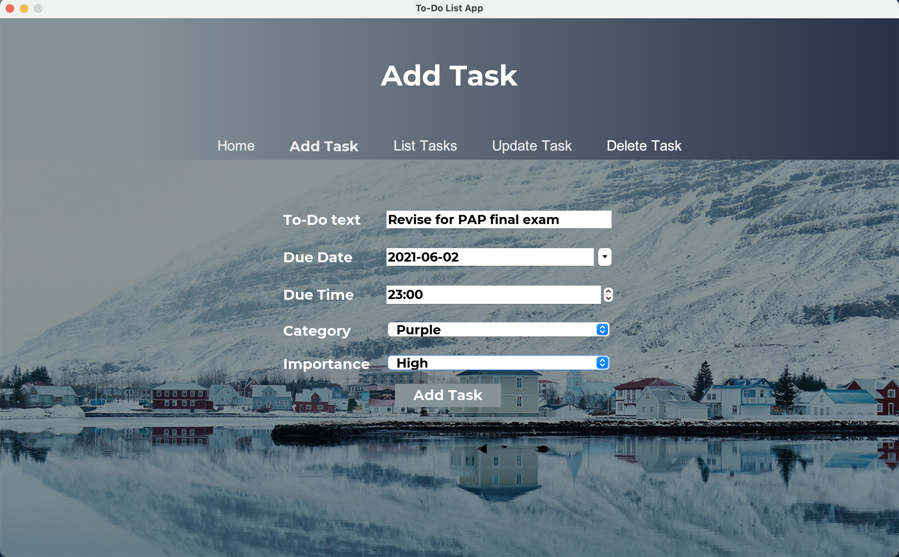
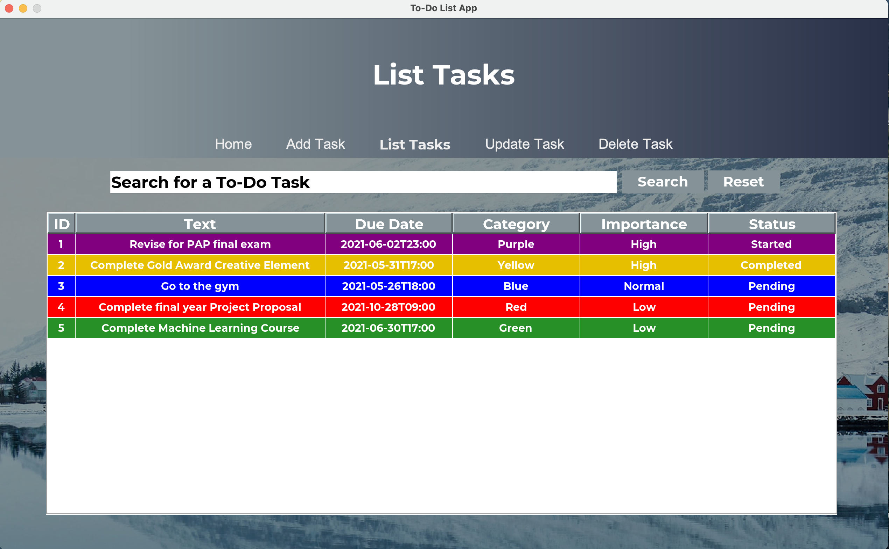
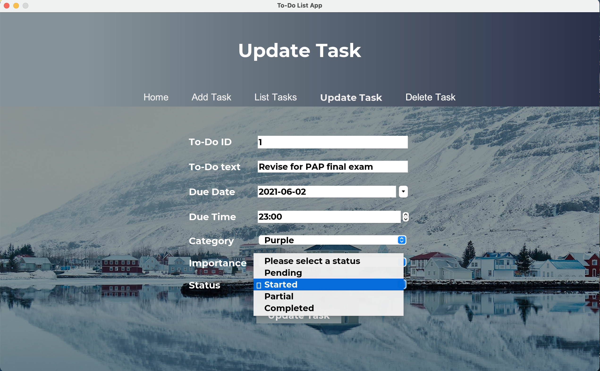
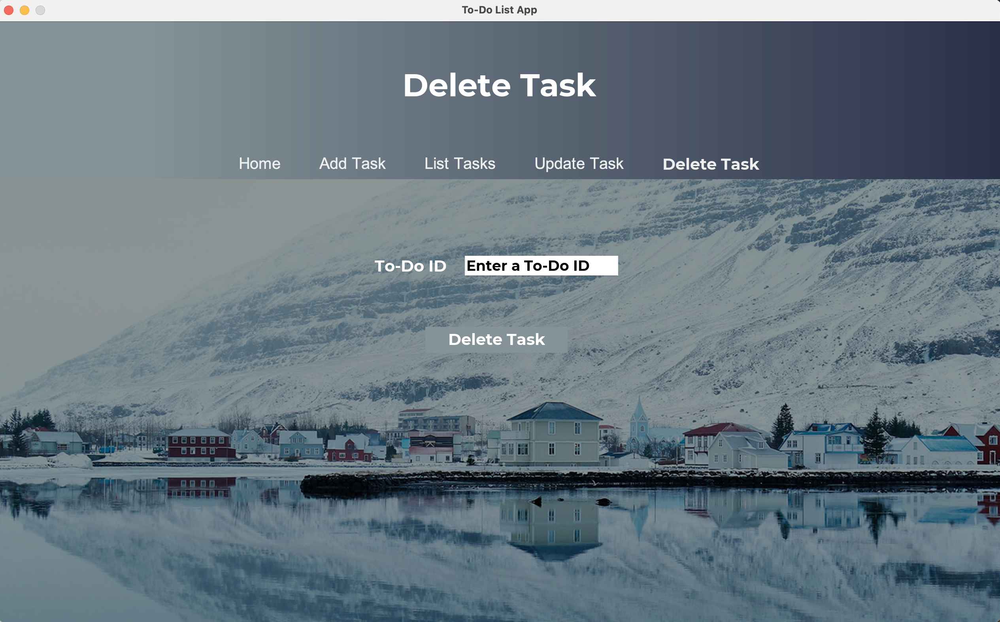

**Note:** In order for the app to be fully functional, ensure you have added all the dependencies to the project structure.

**Home Page**

**Add Task Page**

**List Task Page**

**Update Task Page**

**Delete Task Page**
